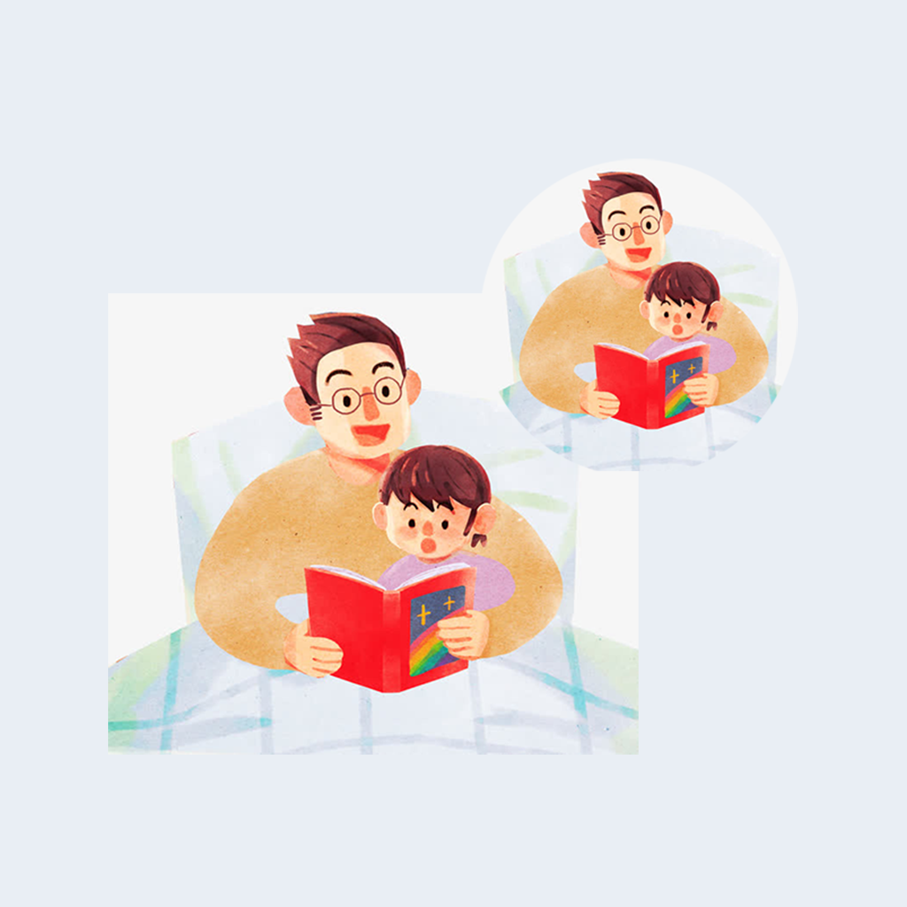

## Welcome to My Child Reads Record Tool 

This is a tool to record parent-child interaction reading. When you come home from work or go to bed every day, accompany your child to read together, tell your child fairy tales, explain to your child the meaning of characters in the book, make your child like reading and develop a good habit of reading.
You can also keep track of how much your child likes different types of books each time they read, where and when they read together, so you can better understand their reading preferences and let them grow up healthily with you

If you have any questions, you can either leave a message or send the questions to our email address.

We will answer them for you in the first time.

### Address: sun778297ma@163.com

Thank you!
